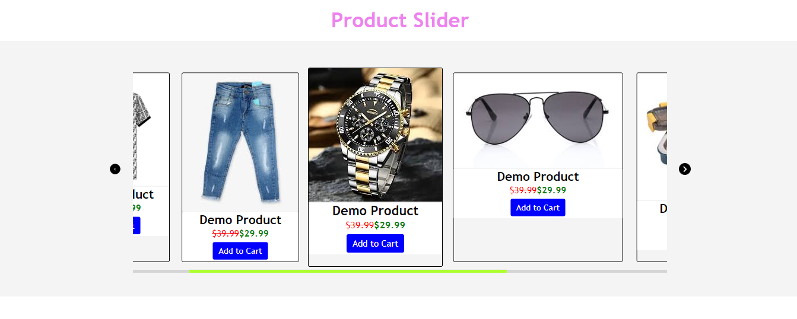

# Product Slider

## Features

* Product Slider is a slider with different products.

* Using this slider we can know details of product and know the price details and offer details.

* It has a add to cart button with help of that we can add our beloved product to cart.

* It has autoplay with overflow for manual slide.

### HTML

* Using html we created a basic container with products images.

* Created button for add to cart and given details of products.

### CSS 

* Using CSS applied styles for the product container,buttons and for product details like prices and offers.

* Created a overflow for sliding the products.

### Java Script

### Created event listeners for the side buttons

* Added event listeners for right and left buttons to slide the products when we click the buttons.

* When we click the right button products slide right and when we click the left button products slide left.

### Created autoplay function 

* Max Scroll Left Calculates the maximum value that slider scrollLeft can reach without exceeding the boundaries of its content.

* autoplay function executes for every 50 milli seconds. It continuously scrolls the slider content to the left untill it reaches max scroll left.

* After it reaches max scroll left limit it resets the slider.

### Added event listener for the products

* Applied loop to add a mouseover event listener to each product element.

* It adds hover effect for every product on mouseover.

